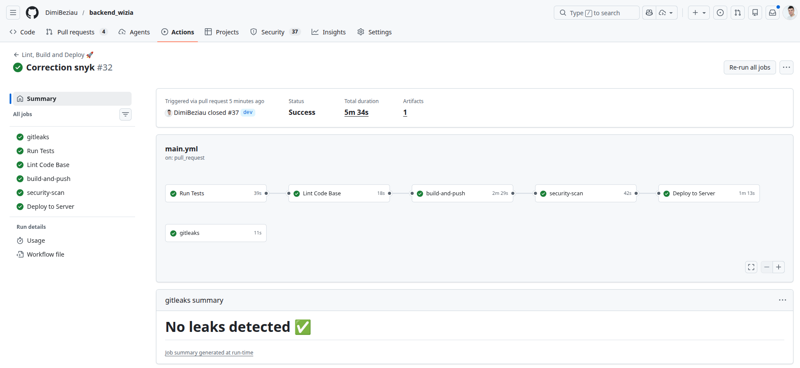
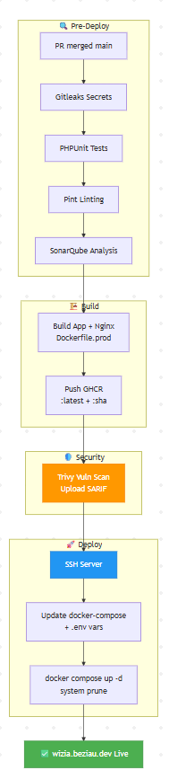
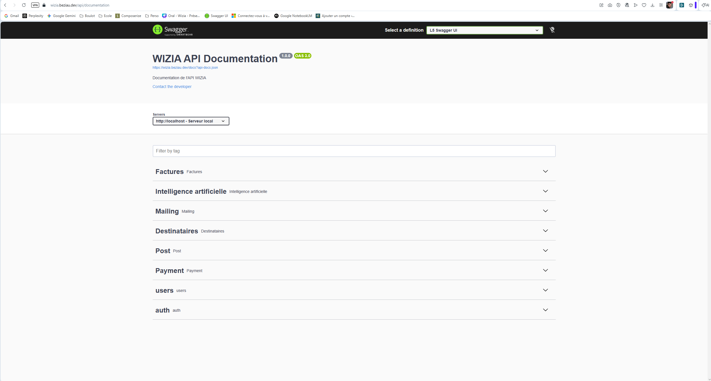
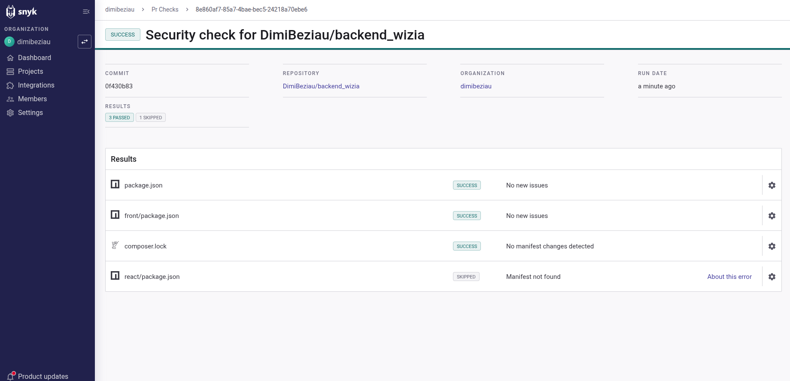
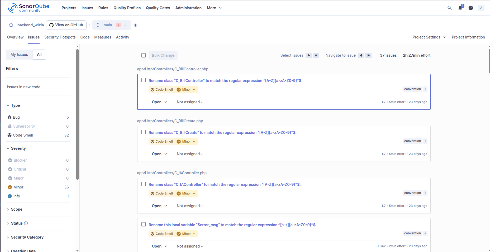
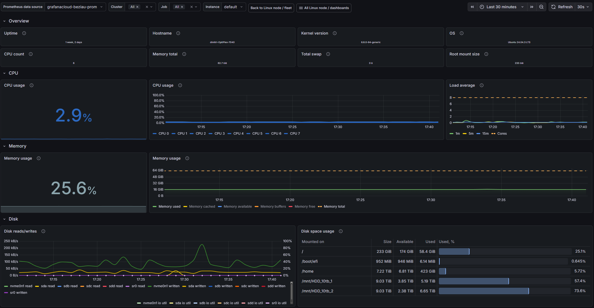
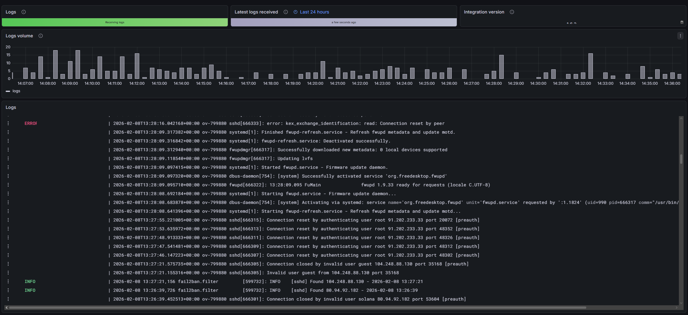

# Architecture

## Pipeline github actions:

## Justification des choix liés aux outils externes

- Github actions: 
    - Gratuit (compte étudiant)
    - Intégration Github et énormément d'autres outils tels que sonarQube ou Docker
    - gestion des secrets

- Docker: 
    - Containerisation
    - Gestion simplifiée des déploiements
    - Armonisation des environnements de développement et de production

- GitLeaks: 
    - Détection des vulnérabilités (oublie de secret dans un repository)
    - Gratuit
    - Intégration Github

- Sonarqube: 
    - Analyse du code
    - Détection des vulnérabilités
    - Détection des bugs
    - Détection des performances
    - Détection des sécurité
    - Détection des qualité
    - Open source

- Trivy: 
    - Détection et upload des vulnérabilités de l'image docker dans le security-tab de github
    - Gratuit
    - Intégration Github

- Snyk: 
    - Détection des vulnérabilités dans les dépendances
    - Gratuit
    - Intégration Github

- Pint: 
    - Formatage du code avant mise en production
    - Gratuit
    - Intégration Github

## Preuves:

[https://wizia.beziau.dev](https://wizia.beziau.dev)

En savoir plus sur ma [démarche devSecOps](./devsecops.md)